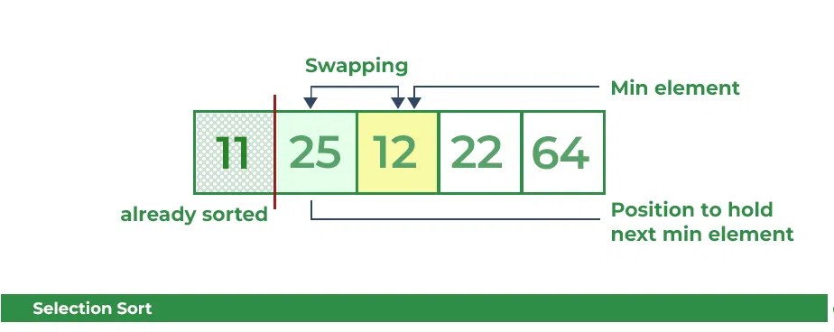

## Selection Sort

Selection Sort, listenin sort edilmemiş kısmından en küçük (veya en büyük) öğeyi tekrar tekrar seçerek ve listenin
sort edilmiş kısmına taşıyarak çalışan basit ve verimli bir sıralama algoritmasıdır.

Sıralanmış dizideki ilk konum için, tüm dizi 0'dan 4'e kadar sırayla gezilir. Şu anda 64'ün saklandığı ilk konum, tüm
diziyi dolaştıktan sonra 11'in en düşük değer olduğu açıktır. Böylece, 64'ü 11 ile değiştirin. Bir yinelemeden sonra,
dizideki en küçük değer olan 11, sıralanmış listenin ilk konumunda görünme eğilimindedir.

25'in bulunduğu ikinci konum için, dizinin geri kalanını yine sıralı bir şekilde geçin. Çaprazlama yaptıktan sonra,
12'nin dizideki en düşük ikinci değer olduğunu ve dizide ikinci sırada görünmesi gerektiğini bulduk, böylece bu
değerleri değiştirdik.

Şimdi, 25'in bulunduğu üçüncü yer için yine dizinin geri kalanını dolaşın ve dizide bulunan en küçük üçüncü değeri
bulun. Çaprazlama yaparken, 22'nin üçüncü en küçük değer olduğu ve dizide üçüncü sırada görünmesi gerektiği ortaya
çıktı, bu nedenle 22'yi üçüncü konumda bulunan elemanla değiştirin.

Benzer şekilde, dördüncü konum için dizinin geri kalanını çaprazlayın ve dizideki en küçük dördüncü elemanı bulun. 25 en
düşük 4. değer olduğu için dördüncü sırada yer alacaktır.

Sonunda dizide bulunan en büyük değer otomatik olarak dizideki son konuma yerleştirilir. Elde edilen dizi sıralanmış
dizidir.

